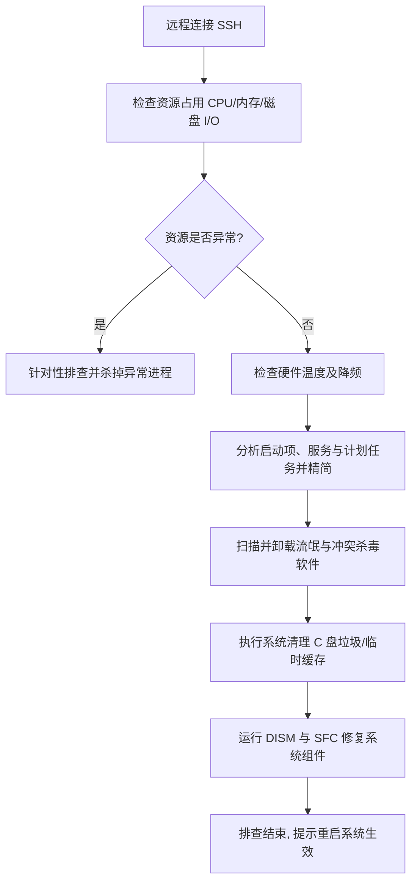

# 07-电脑卡顿排查与优化清单

本文档为远程管理员通过 SSH 连接目标 Windows 电脑后，进行卡顿排查、性能优化与垃圾清理的标准化操作指南。每个检查项均配有对应的 PowerShell 或 CMD 命令，以便于远程执行。

> [!IMPORTANT]
> **顶级安全规则（红线原则）**
> 在未获得用户明确授权/允许的情况下，**严禁修改任何文件、删除任何文件、强行结束进程（Kill Process）或直接实施修复操作**。排查阶段必须遵循“只读分析”原则，仅收集和分析数据，定位问题根源，在取得授权后方可按需处理。

---

## 1. 基础硬件与系统资源分析

当电脑出现严重卡顿或无响应时，首要任务是排查 CPU、内存、温度及磁盘 I/O 是否达到硬件瓶颈。

### 1.1 CPU 占用排查
*   **目的**：找出持续占用 CPU 的后台进程或异常服务。
*   **PowerShell 命令**：
    ```powershell
    # 查找 CPU 占用率前 10 位的进程
    Get-Process | Where-Object {$_.CPU -ne $null} | Sort-Object CPU -Descending | Select-Object -First 10 -Property Name, CPU, Id, Description
    ```

### 1.2 物理内存 (RAM) 占用与泄漏分析
*   **目的**：检查可用物理内存是否不足，找出内存泄漏或异常吃内存的程序。
*   **PowerShell 命令**：
    ```powershell
    # 检查总内存与可用内存（单位：GB）
    Get-CimInstance Win32_OperatingSystem | Select-Object @{Name="TotalMemory(GB)";Expression={[Math]::Round($_.TotalVisibleMemorySize/1MB, 2)}}, @{Name="FreeMemory(GB)";Expression={[Math]::Round($_.FreePhysicalMemory/1MB, 2)}}

    # 按内存占用（工作集）对进程排序，列出前 10 名
    Get-Process | Sort-Object WorkingSet64 -Descending | Select-Object -First 10 -Property Name, @{Name="Memory(MB)";Expression={[Math]::Round($_.WorkingSet64/1MB, 2)}}, Id
    ```

### 1.3 磁盘 I/O 读写与活动时间
*   **目的**：确认是否发生“磁盘 100% 占用”问题。如果是机械硬盘或即将损坏的固态硬盘，高 I/O 队列会导致系统极度卡顿。
*   **PowerShell 命令**：
    ```powershell
    # 检查磁盘当前活动时间比例 (Active Time %)
    Get-Counter -Counter "\LogicalDisk(_Total)\% Disk Time" -SampleInterval 1 -MaxSamples 3
    
    # 查找高频读写磁盘的进程
    Get-Process | Sort-Object IOReadBytes -Descending | Select-Object -First 5 -Property Name, IOReadBytes, IOWriteBytes
    ```

### 1.4 硬件温度与 CPU 降频检查
*   **目的**：确认 CPU 是否因过热导致主频被锁死在极低水平（如 0.79 GHz）。
*   **PowerShell 命令**：
    ```powershell
    # 检查当前 CPU 运行频率与最大主频
    Get-CimInstance Win32_Processor | Select-Object Name, MaxClockSpeed, CurrentClockSpeed
    
    # 部分硬件支持直接获取温度 (结果除以 10 后再减去 273.15 转换为摄氏度)
    Get-CimInstance -Namespace root\wmi -ClassName MsAcpi_ThermalZoneTemperature | Select-Object CurrentTemperature, InstanceName
    ```

### 1.5 系统电源计划配置
*   **目的**：确认系统是否被误设置为“省电模式”限制了 CPU 性能。
*   **CMD 命令**：
    ```cmd
    :: 列出系统所有电源计划，带 * 号的为当前激活的电源计划
    powercfg /list
    ```
*   **优化操作**（如需强制设置为平衡或高性能）：
    ```cmd
    :: 设置为“高性能”电源计划 (High Performance)
    powercfg /setactive 8c5e7fda-e8bf-4a96-9a85-a6e23a8c635c
    ```

---

## 2. 磁盘健康与文件系统清理

C 盘空间不足、磁盘碎片过多或固态硬盘 Trim 未开启都会导致文件读写缓慢。

### 2.1 磁盘空间与健康状况
*   **目的**：检查所有盘符的剩余空间，并获取 SSD 的健康度（HealthStatus）。
*   **PowerShell 命令**：
    ```powershell
    # 检查磁盘分区容量与剩余百分比
    Get-Volume | Select-Object DriveLetter, FriendlyName, FileSystemType, @{Name="Size(GB)";Expression={[Math]::Round($_.Size/1GB, 2)}}, @{Name="RemainingFree(GB)";Expression={[Math]::Round($_.SizeRemaining/1GB, 2)}}
    
    # 检查物理硬盘 S.M.A.R.T 状态
    Get-PhysicalDisk | Select-Object DeviceId, FriendlyName, MediaType, OperationalStatus, HealthStatus
    ```

### 2.2 固态硬盘 (SSD) Trim 状态检查
*   **目的**：确保 Trim 机制开启，防止 SSD 长期使用后写入性能暴跌。
*   **CMD 命令**：
    ```cmd
    :: 查询 Trim 是否启用 (0 表示已启用，1 表示未启用)
    fsutil behavior query DisableDeleteNotify
    ```
*   **优化操作**（启用 Trim）：
    ```cmd
    fsutil behavior set DisableDeleteNotify 0
    ```

### 2.3 C 盘垃圾文件深度分析与清理
*   **目的**：分析并清理临时文件、系统更新缓存、崩溃转储等。
*   **PowerShell/CMD 命令**：
    ```powershell
    # 1. 统计 Temp 临时文件夹大小
    Get-ChildItem -Path "$env:TEMP" -Recurse -ErrorAction SilentlyContinue | Measure-Object -Property Length -Sum | Select-Object @{Name="TempSize(MB)";Expression={[Math]::Round($_.Sum/1MB, 2)}}
    
    # 2. 清除 Windows 临时文件 (需管理员权限)
    Remove-Item -Path "$env:TEMP\*" -Recurse -Force -ErrorAction SilentlyContinue
    Remove-Item -Path "C:\Windows\Temp\*" -Recurse -Force -ErrorAction SilentlyContinue

    # 3. 清理系统更新下载缓存 (删除后可解决部分 Windows Update 导致的卡顿)
    # 步骤：停止 wuauserv 服务 -> 清空目录 -> 启动服务
    Stop-Service -Name wuauserv -Force
    Remove-Item -Path "C:\Windows\SoftwareDistribution\Download\*" -Recurse -Force -ErrorAction SilentlyContinue
    Start-Service -Name wuauserv
    ```

---

## 3. 启动项、服务与计划任务优化

开机自启项过多是电脑“越用越慢”的主要原因。

### 3.1 开机自启项 (Startup) 排查
*   **目的**：查找注册表和启动文件夹中潜伏的自启程序。
*   **PowerShell 命令**：
    ```powershell
    # 1. 检查注册表 HKLM 与 HKCU 下的 Run 启动项
    Get-ItemProperty HKLM:\Software\Microsoft\Windows\CurrentVersion\Run -ErrorAction SilentlyContinue
    Get-ItemProperty HKLM:\Software\Wow6432Node\Microsoft\Windows\CurrentVersion\Run -ErrorAction SilentlyContinue
    Get-ItemProperty HKCU:\Software\Microsoft\Windows\CurrentVersion\Run -ErrorAction SilentlyContinue

    # 2. 检查启动文件夹
    Get-ChildItem -Path "$env:APPDATA\Microsoft\Windows\Start Menu\Programs\Startup" -ErrorAction SilentlyContinue
    Get-ChildItem -Path "C:\ProgramData\Microsoft\Windows\Start Menu\Programs\Startup" -ErrorAction SilentlyContinue
    ```

### 3.2 第三方后台服务清理
*   **目的**：找出非微软官方、且处于运行状态的后台服务，避免其无端消耗内存。
*   **PowerShell 命令**：
    ```powershell
    # 筛选正在运行的、且名称不包含 Windows 或 Microsoft 的第三方服务
    Get-Service | Where-Object {$_.Status -eq 'Running' -and $_.Name -notmatch 'Windows|Microsoft|wuauserv|BITS'} | Select-Object Name, DisplayName, Status
    ```

### 3.3 隐藏的计划任务 (Task Scheduler)
*   **目的**：排查流氓软件或广告组件通过“定时任务”在后台死灰复燃。
*   **PowerShell 命令**：
    ```powershell
    # 列出处于激活状态的非 Microsoft 计划任务
    Get-ScheduledTask | Where-Object {$_.State -ne 'Disabled' -and $_.TaskPath -notmatch '\\Microsoft\\'} | Select-Object TaskName, TaskPath, State
    ```

---

## 4. 安全、广告与流氓软件排查

流氓软件通常伴随着弹窗广告、浏览器劫持等行为。

### 4.1 安全软件（杀毒软件）冲突排查
*   **目的**：列出当前系统注册的杀毒软件，确认是否存在多头并立现象。
*   **PowerShell 命令**：
    ```powershell
    Get-CimInstance -Namespace root\SecurityCenter2 -ClassName AntiVirusProduct | Select-Object displayName, pathToSignedReportingExe, productState
    ```

### 4.2 软件安装列表与流氓软件检查
*   **目的**：扫描已安装应用，定位不需要的臃肿软件（Bloatware）及隐藏安装的流氓工具。
*   **PowerShell 命令**：
    ```powershell
    # 获取 64 位及 32 位安装列表
    $apps = @()
    $apps += Get-ItemProperty HKLM:\Software\Microsoft\Windows\CurrentVersion\Uninstall\* -ErrorAction SilentlyContinue
    $apps += Get-ItemProperty HKLM:\Software\Wow6432Node\Microsoft\Windows\CurrentVersion\Uninstall\* -ErrorAction SilentlyContinue
    $apps += Get-ItemProperty HKCU:\Software\Microsoft\Windows\CurrentVersion\Uninstall\* -ErrorAction SilentlyContinue
    
    $apps | Where-Object {$_.DisplayName -ne $null} | Select-Object DisplayName, DisplayVersion, Publisher, InstallDate | Sort-Object DisplayName
    ```

### 4.3 浏览器劫持与网络配置分析
*   **目的**：检查网络解析设置与代理是否被恶意篡改。
*   **PowerShell/CMD 命令**：
    ```powershell
    # 1. 检查 Hosts 文件是否存在恶意劫持条目
    Get-Content C:\Windows\System32\drivers\etc\hosts -ErrorAction SilentlyContinue

    # 2. 检查系统全局代理设置 (Proxy)
    Get-ItemProperty -Path "HKCU:\Software\Microsoft\Windows\CurrentVersion\Internet Settings" | Select-Object ProxyEnable, ProxyServer
    ```

---

## 5. 系统稳定性与配置分析

有些卡顿是由于系统自身配置错误或核心组件损坏导致的。

### 5.1 资源管理器右键菜单延迟优化
*   **目的**：排查因加载过多第三方右键菜单项导致的资源管理器响应缓慢。
*   **PowerShell 命令**（查看右键菜单相关的注册表 Shell Extensions）：
    ```powershell
    Get-ChildItem -Path "Registry::HKEY_CLASSES_ROOT\*\shellex\ContextMenuHandlers"
    Get-ChildItem -Path "Registry::HKEY_CLASSES_ROOT\Directory\shellex\ContextMenuHandlers"
    ```

### 5.2 Windows Search 索引器排查
*   **目的**：检测 SearchIndexer 是否发生异常无限循环扫描。
*   **PowerShell 命令**：
    ```powershell
    # 检查 Windows Search 服务状态及进程 CPU 占用
    Get-Service -Name WSearch
    Get-Process -Name SearchIndexer -ErrorAction SilentlyContinue | Select-Object Name, CPU, WorkingSet
    ```

### 5.3 系统文件损坏扫描与修复
*   **目的**：使用官方自带工具自动校正损坏的系统组件和 DLL 依赖。
*   **CMD 命令**（需管理员权限，远程执行可能耗时 5-15 分钟）：
    ```cmd
    :: 扫描并修复映像文件
    dism /online /cleanup-image /restorehealth
    
    :: 校验系统文件的完整性
    sfc /scannow
    ```

### 5.4 Windows 事件日志诊断
*   **目的**：快速提取最近发生的系统或应用层报错，定位导致卡死或死锁的驱动/软件。
*   **PowerShell 命令**：
    ```powershell
    # 获取系统日志中最近发生的 15 条错误 (Error) 日志
    Get-EventLog -LogName System -EntryType Error -Newest 15 | Select-Object TimeGenerated, Source, Message | Format-List
    ```

---

## 6. 排查总结与流程建议

建议在通过远程 SSH 接入电脑后，按照以下步骤规范进行操作：



### 常用一键排查脚本示例
你可以在 SSH 终端中直接运行以下合并命令进行快速概览：
```powershell
Write-Host "====== CPU Top 5 ======" -ForegroundColor Green; Get-Process | Sort-Object CPU -Descending | Select-Object -First 5 -Property Name, CPU; Write-Host "====== Memory Top 5 ======" -ForegroundColor Green; Get-Process | Sort-Object WorkingSet64 -Descending | Select-Object -First 5 -Property Name, @{Name="WS(MB)";Expression={[Math]::Round($_.WorkingSet64/1MB, 2)}}; Write-Host "====== Drive Info ======" -ForegroundColor Green; Get-Volume | Select-Object DriveLetter, FileSystemType, @{Name="Free(GB)";Expression={[Math]::Round($_.SizeRemaining/1GB, 2)}}
```
